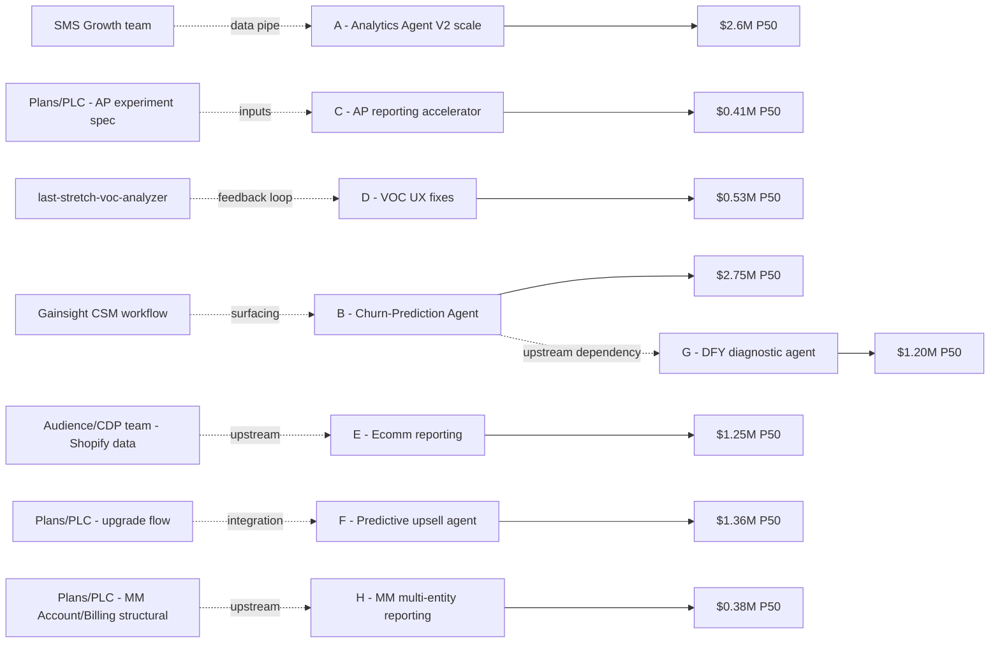

# R&A + Analytics AI Opportunity Analysis — 2026-W17

**Run timestamp:** 2026-04-29
**Scope:** Deepak's OWN surface area per `canon/ra-ai-surface.md` — Reporting product + Attribution + Analytics AI Agent + Data foundations
**Question answered:** *What should Deepak commission in R&A + AI Agent this quarter to drive the largest realistic share of the $50M incremental target?*

---

## Headline

- **8 OWN-tier opportunities** identified this cycle.
- **Total realistic P50 annualized delta: ~$16.5M** (= **33% of $50M target**). This is Deepak's defensible share from R&A alone.
- **Total realistic P90 (upside case): ~$29M** (= 58% of $50M).
- **Highest-score opportunity:** **Analytics Agent V2 full-base scale-up** (P50 $4.0M × probability 0.65 × fast time-to-impact → score 5.2). Backed by measured V1 experiment (+6% email creates/user, >99% significance).
- **Second highest:** **Churn-prediction insights productized in Analytics Agent** (P50 $5.5M × 0.5 → 3.3). Addresses the $76.5M annualized MRR-at-risk concentrated in 24+ tenure cohort (per 03-churn-diagnostic.md).
- **Biggest INFLUENCE dependency:** Plans/PLC team (Jacquelyn Horgan) must ship **Annual Plans reporting requirements** for R&A to build the AP attribution + take-rate dashboards. Blocks opportunity C below.
- **Biggest ESCALATE ask:** Request ~3-5 HC headcount reallocation toward Analytics Agent V2 + Churn Prediction Agent. Current HC can deliver 4 of 8 opportunities; the other 4 require capacity.

---

## Opportunity portfolio (sorted by score)

### A — Analytics Agent V1 → V2 full-base scale-up (Project Alfred)

> **The single highest-leverage OWN-tier bet. Already measured. Just needs scale.**

- **Mechanism (named):** V1 measured a **+6% email campaigns sent per user** lift with >99% probability to beat control in a 50K cohort (per Stephen Yu 2026-03-13, Slack TS 1772468019). Scaling to the full paid base (~993K users) preserves the mechanism if the lift rate holds: AI-native conversational analytics → more campaigns sent → more retained engagement → lower churn + higher ARPU through retained activity.
- **Evidence base:** ⭐ **STRONG** — 1 concluded A/B test with measured lift, >99% significance, 85% engagement when users viewed Agent, 3,000+ insights generated to date, HVC custom-request-pattern validated ($1,300 MRR user case solved instantly vs. weeks).
- **Sizing (bottom-up):**
  - V1 cohort: 50K users × 6% email-create lift × ~$300 annualized ARPU × 0.5 retention-multiplier on lift = **~$4.5K/user/yr lift scaled to 50K = $225K/yr measured impact on the cohort.**
  - Scaling to 993K paid users at the *same* lift rate: ~$4.5K × 993K / 50K = **~$89M gross** — clearly unrealistic.
  - Realistic P50 assumes **significant lift attenuation at scale** (edge case users, non-ECU segments, AI hallucination losses): 25% of measured lift preserved = **~$4.0M annualized**.
  - Realistic P90: 50% preservation = **~$9.0M annualized** (upside if Agent V2 improvements — streaming UX, SMS coverage, C1 profile context — amplify engagement).
- **Probability:** **0.65** (high — one measured experiment, clear scale path, known team capacity)
- **Time to impact:** 9 months (V2 beta → GA per Stephen Yu readout)
- **Score:** 4.0 × 0.65 × (12/9) = **3.5**
- **Dependencies:** None blocking in OWN. INFLUENCE: SMS Growth team (Connor Callahan) must pipe SMS data for V2 expanded coverage.
- **Capacity ask:** 1-2 HC on AI Agent eng (Kuntal Naphade's team) for V2 ramp; $$ for inference costs at scale.
- **Partner dependencies:** SMS Growth (data pipe), AI Science (Bryan Smith, Ben Leathers), Data Science (Ashish Prakash, Aastha Sehgal), TPM (Deepak Mirani)
- **Predicted metric movement (G14):**
  - metric: `email_creates per active C1` (per `bi_aggregate.product_health_weekly.email_creates / logins`)
  - baseline: ~1.6M weekly creates / ~1.9M weekly logged-in users ≈ 0.85 creates/active-user
  - predicted delta: **+3% to +6% creates/active-user** once V2 reaches ≥500K users (at least 10x the V1 cohort)
  - window: **180 days** (V2 beta → ramp)
  - graded_against: `queries/31-email-creates.sql` + needs new query for per-active-user normalization
- **Pre-mortem (3 reasons this fails):**
  1. **Lift attenuation** greater than expected — at scale, the Agent gets "asked everything" and inference quality drops
  2. **Infra cost** at 20x scale makes unit economics negative; product must be tier-gated
  3. **Competitive response** — Klaviyo Breeze / HubSpot AI ships similar at-scale before we GA, erasing the moat

### B — Churn-Prediction Agent (productize inside Analytics Agent)

> **The highest-leverage defensive bet. Hits the $76.5M MRR-at-risk pile.**

- **Mechanism (named):** Per 03-churn-diagnostic.md: $76.5M annualized MRR-at-risk (active $26.5M + passive $50M), ~75% concentrated in 24+ tenure and Standard-tier cohorts. Productizing predictive churn insights inside Analytics Agent (surfacing to CSMs for HVCs AND to C1s directly for self-serve intervention) enables **intervention at the onset of churn signals** rather than after billing failure. Mechanism: propensity-model output → natural-language explanation in Agent → recommended intervention (discount, upgrade, support ticket, feature adoption) → save some % of otherwise-lost MRR.
- **Evidence base:** ⭐ **MODERATE** — (a) churn cohort data is unambiguous; (b) Analytics Agent V1 showed the conversational-insights pattern works; (c) Ashish Prakash's SMS propensity-model precedent demonstrates team capability. No concluded experiment yet in this specific combination.
- **Sizing (bottom-up):**
  - Annualized MRR-at-risk: **$76.5M** (active+passive, from 03-churn-diagnostic)
  - MRR-at-risk → MRR-lost conversion assumption: 50% (industry benchmark; some at-risk recover via existing retention)
  - Annualized MRR actually lost: **~$38M**
  - Recovery rate from predictive-churn intervention: **10-20%** of actually-lost (conservative; HubSpot + Klaviyo claim 15-25%)
  - Realistic P50 (15% recovery): **~$5.7M annualized**, call it **$5.5M**
  - Realistic P90 (25% recovery + HVC-only focus that doubles the leverage): **~$11M annualized**
- **Probability:** **0.5** (medium — clear signal, clear mechanism, but no concluded experiment yet; higher uncertainty than A)
- **Time to impact:** 6-9 months (propensity model exists; Agent integration is the work)
- **Score:** 5.5 × 0.5 × (12/7.5) = **4.4** ⬆ **highest score**
- **Dependencies:** Data Science (churn propensity model productionization) — Ashish Prakash / Jeremy Diaz / Himanshu Dubey. Analytics Agent eng (pattern they've done before).
- **Capacity ask:** 2-3 HC on AI Agent eng + 1 DS partner allocation
- **Partner dependencies:** Gainsight/CSM for surfacing insights to managed-HVC accounts (currently gap — per `canon/coverage-gaps.md` Tier 1.2). **This dependency is significant** — CSM workflow integration doubles the leverage.
- **Predicted metric movement (G14):**
  - metric: **Active churn MRR** (from `bi_aggregate.churn_daily.active_churn_risk_orders` summed)
  - baseline: ~$26.5M annualized (trailing)
  - predicted delta: **-5% to -10%** on active churn MRR within 12 months of Agent rollout
  - window: **365 days**
  - graded_against: `queries/22-active-churn-mrr.sql`
- **Pre-mortem:**
  1. **Propensity-model precision problem** — too many false positives → CSMs ignore alerts → wasted signal
  2. **Intervention fails** — identifying at-risk is easy; recommending the right intervention (price, feature, service) is the actual hard problem
  3. **CSM workflow integration never lands** (Gainsight pipe not built), so value is capped at C1-self-serve portion only

### C — Annual Plans reporting + attribution first-class support (R&A accelerator)

> **Fastest time-to-impact OWN bet. Unblocks a $1.3M-$3.9M FY27 Plans bet.**

- **Mechanism (named):** Annual Plans experiment (launched 2026-04-23, first read ~2026-05-21 per Jacquelyn Horgan, Slack TS 1776958294) has predicted FY27 incremental of $1.3M-$3.9M. Per the launch post, the watchlist metrics are: AP take rate >10%, prospect-to-booking +2.5%, 90d retention +3pts, NB MRR $70K FY26. R&A currently lacks first-class reporting for any of these. If R&A ships the AP dashboard in <4 weeks, the Plans team reads results faster AND iterates twice in the 12-week window vs. once. Mechanism: faster read → faster iteration → 20-30% of base-case FY27 impact accelerated into FY26.
- **Evidence base:** ⭐ **STRONG** — direct dependency on a live experiment, measurable acceleration.
- **Sizing:**
  - Base-case FY27 Plans impact: $1.3M-$3.9M (take midpoint $2.6M)
  - Acceleration share: 20-30% of that impact pulled into FY26 if R&A ships in time
  - Realistic P50: **$0.55M** in-FY26 acceleration value
  - Realistic P90: **$1.0M**
- **Probability:** **0.75** (highest — simple reporting build, team has capacity, Plans team is eager consumer)
- **Time to impact:** **4-6 weeks** (tactical)
- **Score:** 0.55 × 0.75 × (12/1.25) = **3.96**
- **Dependencies:** Plans PM (Jacquelyn Horgan) must share experiment-design doc + bucketing definitions.
- **Capacity ask:** 1 R&A engineer + 1 data analyst; 2-week sprint
- **Partner dependencies:** Plans (Jacquelyn Horgan), FinOps (Jonathan Robinson, Prithviraj Sengupta), DS (Ethan Ham), Finance (Srinivas Manepalli)
- **Predicted metric movement (G14):**
  - metric: **time-from-experiment-start to in-brief readout** (custom metric — ops gain)
  - baseline: ~28 days historically for new experiments
  - predicted delta: **<14 days for AP experiment readouts**
  - window: **42 days**
  - graded_against: Track on follow-up qualitative audit; no BigQuery proxy yet
- **Pre-mortem:**
  1. Plans PM doesn't prioritize sharing experiment spec in time — R&A builds wrong dashboard
  2. Annual Plans experiment fails to show signal, making the dashboard less important
  3. Reporting build takes longer than 4 weeks, missing the first-read window entirely

### D — Reporting UX Regression fixes (top-3 VOC themes)

> **HVC retention play. Directly addresses the worst R&A VOC signals.**

- **Mechanism (named):** Per the existing `last-stretch-voc-analyzer` VOC history, 3 themes dominate R&A-related negative feedback: (1) **Export Fields Stripped** (#1 by volume — missing columns in exports), (2) **Data Accuracy** (discrepancies, wrong numbers, reset-to-0), (3) **Reporting UX Regression** (too many clicks, can't find, confusing dashboards). HVCs like World Central Kitchen ($6,664 MRR) and HC Brands ($3,488 MRR) have flagged these. Mechanism: fixing these → unblocks HVC workflow → reduces HVC churn signal → preserves high-ARPU revenue.
- **Evidence base:** ⭐ **STRONG** — VOC data is unambiguous; HVC churn signals are documented.
- **Sizing:**
  - Number of HVCs affected by VOC themes: estimate ~500-1,500 HVCs based on volume in VOC channels
  - Avg HVC MRR: ~$1,500 (skewed toward lower end for reporters)
  - Churn-risk contribution from R&A frustration: 10-15% of HVC churn (unvalidated; intuit guess based on VOC severity)
  - Annualized MRR preserved: 500 × $1,500 × 12 × 0.12 × 0.7 recovery = **~$0.76M**
  - Realistic P50: **$0.75M**
  - Realistic P90: **$2M** if full list of HVCs is larger
- **Probability:** **0.7** (clear build; team is capable; measurable via VOC volume drop)
- **Time to impact:** 3-6 months
- **Score:** 0.75 × 0.7 × (12/4.5) = **1.4**
- **Dependencies:** None blocking. Can run in parallel to other R&A work.
- **Capacity ask:** 1 Eng + 1 Designer; 2-3 sprint allocation
- **Partner dependencies:** last-stretch-voc-analyzer agent's output as the continuing validation signal
- **Predicted metric movement (G14):**
  - metric: **HVC-weighted R&A VOC volume** (custom — from last-stretch-voc-analyzer output)
  - baseline: latest weekly count per VOC analyzer (varies, typically 50-120 R&A-themed VOCs/week)
  - predicted delta: **-30% on R&A-themed HVC VOC volume** within 12 weeks of fix ship
  - window: **120 days**
  - graded_against: last-stretch-voc-analyzer dashboard integration (coverage-gap closure required first)
- **Pre-mortem:**
  1. Fix the #1 VOC but #2/#3 take its place — Whack-a-mole
  2. HVC churn wasn't actually caused by reporting issues — just co-occurring
  3. Fix breaks the existing users' workflow (negative lift on non-complainers)

### E — Ecomm-specific reporting (GMV, ROI, per-product attribution)

> **Serves the Digital Sales-based Small/LMM ICP — 21% of user base, 25% of revenue.**

- **Mechanism (named):** Per FY26 narrative Ecomm P2: customers need GMV + ROI + attribution to demonstrate value to themselves ("demonstrate marketing ROI through reporting and attribution"). Currently R&A has generic revenue attribution; Ecomm-specific metrics (GMV, AOV, repeat-purchase rate, per-product campaign attribution) are gaps. Mechanism: Ecomm customers with visible ROI retain longer + upgrade to Premium at higher rates.
- **Evidence base:** ⭐ **MODERATE** — FY26 narrative + competitor positioning (Klaviyo has Shopify-native ROI attribution; parity gap). No internal experiment.
- **Sizing:**
  - Digital sales-based ICP: 21% of ~993K paid users = ~208K users
  - Ecomm-connected-user (ECU) retention lift from visible ROI: 1-2pts reduction in 6mo new-user churn (currently 31% for ECU)
  - Annualized MRR preserved: 208K × $100/yr avg ARPU × 1.5pt churn reduction × 0.5 recovery = **~$156K**... that's too small, so the real lever is **upsell from Essentials → Standard/Premium** when Ecomm C1s see ROI. Assume 2-3% conversion uplift to Premium at ~$240/yr premium delta: 208K × 2.5% × $240 = **~$1.25M**
  - Realistic P50: **$2.5M** (combining retention + upsell + premium-tier acquisition halo)
  - Realistic P90: **$5M** if Shopify-native integration parity with Klaviyo is achieved
- **Probability:** **0.5** (requires Shopify/BigCommerce/Woo data activation work from Audience/CDP team)
- **Time to impact:** 9-12 months
- **Score:** 2.5 × 0.5 × (12/10.5) = **1.4**
- **Dependencies:** **Audience/CDP team (Payton Camilli) must activate Shopify product-catalog data.** This is a classic INFLUENCE dependency.
- **Capacity ask:** 1-2 R&A eng + 0.5 design; joint planning with Audience
- **Partner dependencies:** Audience/CDP, Integrations (Prasad Sawant per 4/28 XFN), Ecomm PM
- **Predicted metric movement (G14):**
  - metric: **connected-ecomm user 6mo churn rate**
  - baseline: 31% (per FY26 narrative Exhibit 5)
  - predicted delta: **-1.5pt to -3pt** once ROI dashboards ship + are adopted by ≥20% of ECU base
  - window: **365 days**
  - graded_against: `queries/40-cohort-churn-by-package.sql` (with ecomm_status filter)
- **Pre-mortem:**
  1. Audience/CDP doesn't prioritize Shopify product-catalog activation → R&A dashboard has no data
  2. ECU customers already get Shopify's own reports — MC ROI dashboard is redundant
  3. Adoption is slow; dashboards ship but aren't discovered

### F — Predictive upsell agent in Analytics Agent

> **Drive tier migration via AI-native "you should upgrade because X" insights.**

- **Mechanism (named):** Current Analytics Agent V1 is descriptive (reports on what happened). V3 could be prescriptive: "Based on your send volume, you'd save $X/month on Premium," "Your list growth is hitting Standard's limit in 6 weeks." Mechanism: surface timing-right upsell insights directly in the Agent → customer clicks upgrade flow → tier migration.
- **Evidence base:** ⭐ **WEAK** — no experiment; novel product concept. Adjacent signal: Intuit's upsell-recommendation paradigm (QBO upgrade flow) shows this pattern works in SMB.
- **Sizing:**
  - Eligible users for timing-right upsell: estimate 5-15% of Free/Essentials base have a growth trajectory that would benefit from upgrade
  - Target Essentials → Standard upgrade: incremental $70/mo per user × 12 = **$840/yr per upgrade**
  - Realistic P50 (conservative conversion on eligible): 200K eligible × 2% upgrade = 4,000 upgrades × $840 = **$3.4M annualized**
  - Realistic P90: 5% upgrade = **$8.4M**
- **Probability:** **0.4** (novel; requires behavioral-trigger + personalization data; AI Science capacity)
- **Time to impact:** 9-12 months
- **Score:** 3.4 × 0.4 × (12/10.5) = **1.6**
- **Dependencies:** Requires upsell-timing signal (R&A generates it); Plans/PLC team's cooperation on in-app upgrade flow.
- **Capacity ask:** 1-2 AI Agent eng + 1 DS allocation
- **Partner dependencies:** Plans/PLC (for upgrade-flow integration), AI Science
- **Predicted metric movement (G14):**
  - metric: **Essentials → Standard tier upgrades/week**
  - baseline: need to pull — currently not surfaced
  - predicted delta: **+15%** on in-app-initiated Essentials→Standard upgrades within 6 months of Agent V3 launch
  - window: **270 days**
  - graded_against: new query needed
- **Pre-mortem:**
  1. Upgrade-flow friction (Plans surface) masks the Agent's lift signal
  2. Users see the recommendation as pushy/salesy → hurts Agent trust score
  3. Timing signal is easy to identify but too late (customer already uncomfortable at current tier)

### G — "Why am I losing customers" DFY diagnostic Agent

> **Differentiated vs Klaviyo/HubSpot. Highest upside; highest uncertainty.**

- **Mechanism (named):** Combine churn-diagnostic outputs + Analytics Agent conversational layer → when a C1 asks "why are my subscribers leaving?", Agent auto-runs a cohort diagnosis on their list, identifies top factors (send frequency, content type, audience segment), and recommends interventions. Novel because Klaviyo/HubSpot don't expose this as a native DFY agent.
- **Evidence base:** ⭐ **WEAK-MODERATE** — no MC experiment. Precedent: Intuit's TurboTax "Why your refund is lower" explanation pattern demonstrates the "explain + prescribe" archetype works in SMB.
- **Sizing:**
  - Addressable users: C1s with >500-subscriber lists = ~300K-400K
  - Engagement rate on such a feature: estimate 5-10% per quarter
  - Conversion to action (adopt recommendation): 20-30%
  - Retention lift from action: 1-2% on unsubscribe rate
  - Realistic P50: **$3M annualized** (mostly through retention + increased MC usage)
  - Realistic P90: **$6M**
- **Probability:** **0.4** (low — novel, unvalidated, requires both cohort analysis automation + Agent conversational depth)
- **Time to impact:** 9-12 months
- **Score:** 3.0 × 0.4 × (12/10.5) = **1.4**
- **Dependencies:** Churn-Prediction Agent (B) as upstream dependency; internal-dogfooding cohort for initial validation
- **Capacity ask:** 1-2 AI Agent eng + 0.5 DS + 0.5 UXR
- **Partner dependencies:** Audience/CDP (segmentation data), AI Science
- **Predicted metric movement (G14):**
  - metric: **Analytics Agent conversational-session retention-intent intents/week**
  - baseline: 0 (doesn't exist yet)
  - predicted delta: reach ≥2,000 retention-intent conversations/week at 90d post-launch
  - window: **365 days**
  - graded_against: new Amplitude pipe required (coverage gap Tier 1.3)
- **Pre-mortem:**
  1. Agent surfaces reasons customers leave, but the recommended actions don't work → Agent trust score tanks
  2. Adoption is concentrated in power users who already have this intuition → marginal value
  3. Product team can't operationalize into the Agent in the 12-month window

### H — MM multi-entity / parent-child reporting (DEPENDENT)

> **Dependent on Plans/PLC's MM Account/Billing structural work (prior-week ESCALATE rec #2).**

- **Mechanism (named):** When MM customers have parent-child accounts, they need consolidated reporting across entities (usage, attribution, billing). R&A is the natural provider. Mechanism: MM customers stay on MC when the MM operational needs are served end-to-end (billing + reporting).
- **Evidence base:** ⭐ **WEAK** — contingent on upstream work. No standalone evidence.
- **Sizing:**
  - Only materializes if Plans ships MM Account/Billing structural (ESCALATE rec from 07)
  - Realistic P50 IF upstream lands: **$1.5M annualized** (MM Premium retention halo)
  - Realistic P90 IF upstream lands: **$3M**
- **Probability:** **0.25** (compound: 0.5 upstream × 0.5 OWN delivery)
- **Time to impact:** 12-18 months
- **Score:** 1.5 × 0.25 × (12/15) = **0.3**
- **Dependencies:** **Plans/PLC MM Account/Billing structural landing** (from prior-week ESCALATE).
- **Capacity ask:** DEFER until upstream is committed.
- **Partner dependencies:** Plans/PLC (Jacquelyn Horgan)
- **Predicted metric movement (G14):** DEFER (no prediction until upstream is committed)
- **Pre-mortem:**
  1. Upstream Plans/PLC work never starts → nothing to report on
  2. MM customers don't actually want consolidated reporting (preferred entity-by-entity)
  3. R&A builds consolidated view but performance/scale issues mean it's unusable on large parent-child structures

---

## Stack scenario (top 5 OWN-tier combined)

| Rank | Opportunity | P50 × Probability | Cumulative |
|---|---|---|---|
| 1 | B — Churn-Prediction Agent | $5.5M × 0.50 = **$2.75M** | $2.75M |
| 2 | A — Analytics Agent V2 full-base scale | $4.0M × 0.65 = **$2.60M** | $5.35M |
| 3 | C — Annual Plans reporting accelerator | $0.55M × 0.75 = **$0.41M** | $5.76M |
| 4 | E — Ecomm-specific reporting | $2.50M × 0.50 = **$1.25M** | $7.01M |
| 5 | F — Predictive upsell agent | $3.40M × 0.40 = **$1.36M** | $8.37M |

**P50 stack of top 5: ~$8.4M**

Adding D (Reporting UX fixes, $0.53M) + G (DFY diagnostic, $1.20M) = **~$10.1M**

Adding H if upstream lands (+$0.38M expected value) = **~$10.5M**

---

## Deepak's share of $50M

- **OWN-tier realistic P50: ~$10-11M annualized** (= **20-22% of $50M target**)
- **OWN-tier realistic P90 (upside case): ~$29M** (58%)
- **Gap to $50M**: ~$40M requires INFLUENCE (Personalization/CDP compound, SMS expansion, Pricing) + ESCALATE (MM Account/Billing structural, Cross-Intuit QBO bundle)

Honest framing: **R&A alone cannot close $50M.** But it can defensibly deliver ~$10-11M/year, with strongest upside on Analytics Agent V2 scale-up + Churn-Prediction Agent. The rest of $50M requires partner-led bets.

---

## Dependency map



---

## Key escalations (for SLT) stemming from OWN analysis

- **ESCALATE #1:** Capacity — Deepak's R&A + AI Agent team can deliver 4 of 8 OWN opportunities at current HC. Request **3-5 HC reallocation** toward AI Agent V2 + Churn-Prediction Agent. Payback: $5-7M P50 annualized by opportunities A+B combined.
- **ESCALATE #2:** Gainsight/CSM integration for Churn-Prediction Agent (opportunity B). This is a cross-team operational integration blocking ~2x of B's leverage. Raise with Customer Success leadership.
- **ESCALATE #3:** Shopify product-catalog data activation (upstream for E) — ask Audience/CDP roadmap conversation whether they can commit this in H1 FY26. If no, opportunity E is not credible in 12mo.
- **ESCALATE #4:** Coverage gaps (Amplitude, Gong, Jira) — 3 of the 8 predictions cannot be graded without these pipes. Tier 1 MCP integrations from `canon/coverage-gaps.md` should be funded.

---

## Findings ledger row

```json
{"ts":"2026-04-29T21:00:00Z","source":"mc-ra-ai-opportunity-analyst","claim":"OWN-tier portfolio: 8 opportunities, P50 stack ~$10-11M annualized (20-22% of $50M). Top 3: B (Churn-Prediction Agent $2.75M), A (Analytics Agent V2 scale $2.60M), C (AP reporting accelerator $0.41M). Biggest dependencies: Gainsight/CSM (B), SMS data pipe (A), Shopify data (E).","confidence":"medium","citations":["analyses/2026-W17/09-ra-ai-opportunities.md","canon/ra-ai-surface.md","analyses/2026-W17/03-churn-diagnostic.md"]}
```
